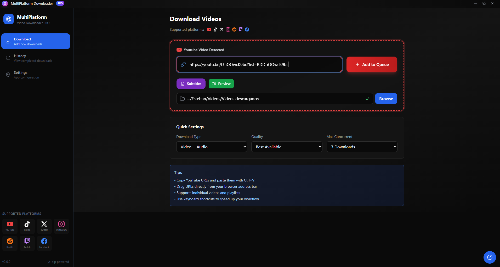
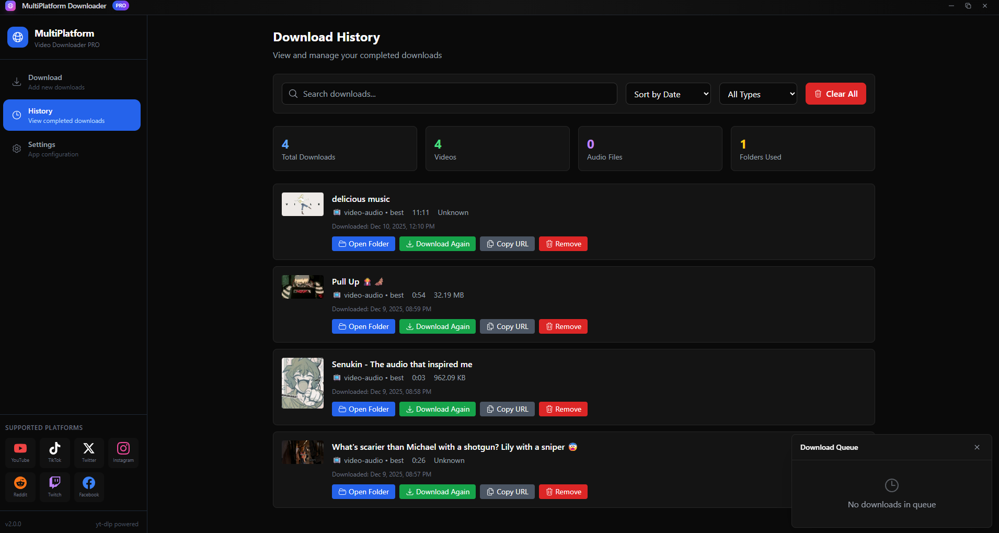

# MultiPlatform Downloader

[](https://reactjs.org/)
[](https://www.electronjs.org/)
[](https://www.typescriptlang.org/)
[](https://tailwindcss.com/)
[](https://opensource.org/licenses/MIT)

Una aplicacion de escritorio moderna para descargar videos de multiples plataformas con una interfaz intuitiva y potente sistema de gestion de descargas.



## Caracteristicas

### Plataformas Soportadas
- **YouTube** - Videos, Shorts, y Playlists completas
- **TikTok** - Videos publicos
- **Twitter/X** - Videos de tweets
- **Instagram** - Reels y videos de posts
- **Reddit** - Videos de posts
- **Twitch** - Clips y VODs
- **Facebook** - Videos publicos

### Funcionalidades Principales
- Descarga de video/audio en multiples calidades (hasta 4K)
- Extraccion de audio en MP3, M4A, WAV, FLAC
- Descarga de playlists completas de YouTube
- Cola de descargas con gestion de prioridad
- Pausar/Reanudar descargas en progreso
- Monitor de ancho de banda con limites configurables
- Tema oscuro moderno
- Atajos de teclado para acciones rapidas
- Actualizaciones automaticas



### Caracteristicas Avanzadas
- Deteccion automatica de FFmpeg y yt-dlp
- Control de ancho de banda con horarios
- Sistema de cache para metadata
- Notificaciones de progreso y completado
- Historial de descargas
- Proxy configurable


## Requisitos del Sistema

### Dependencias Externas (Obligatorias)
- **[yt-dlp](https://github.com/yt-dlp/yt-dlp)** - Motor de descarga de videos
- **[FFmpeg](https://ffmpeg.org/)** - Procesamiento y merge de video/audio

### Instalacion de Dependencias

#### Windows
```powershell
# Usando winget (recomendado)
winget install --id=yt-dlp.yt-dlp -e
winget install --id=Gyan.FFmpeg -e

# O usando Chocolatey
choco install yt-dlp ffmpeg
```

#### macOS
```bash
# Usando Homebrew
brew install yt-dlp ffmpeg
```

#### Linux
```bash
# Ubuntu/Debian
sudo apt update
sudo apt install yt-dlp ffmpeg

# Fedora
sudo dnf install yt-dlp ffmpeg

# Arch Linux
sudo pacman -S yt-dlp ffmpeg
```

## Instalacion

### Opcion 1: Descargar el Instalador
Descarga la ultima version desde [Releases](https://github.com/tebansalas97/MultiPlatform-Downloader/releases).

### Opcion 2: Compilar desde Codigo Fuente

```bash
# Clonar el repositorio
git clone https://github.com/tebansalas97/MultiPlatform-Downloader.git
cd MultiPlatform-Downloader

# Instalar dependencias
npm install

# Iniciar en modo desarrollo
npm run electron-dev

# Crear ejecutable
npm run dist
```

## Scripts Disponibles

| Script | Descripcion |
|--------|-------------|
| `npm start` | Inicia el servidor de desarrollo React |
| `npm run electron-dev` | Inicia la app en modo desarrollo |
| `npm run build` | Compila la aplicacion React |
| `npm run dist` | Crea el instalador de escritorio |
| `npm test` | Ejecuta las pruebas |

## Uso

### Descarga Basica
1. Copia la URL del video
2. Pega en la aplicacion (o usa `Ctrl+V`)
3. Selecciona la calidad deseada
4. Haz clic en "Descargar"

### Descargar Playlist de YouTube
1. Pega la URL de la playlist
2. Selecciona los videos que deseas
3. Configura calidad y carpeta de destino
4. Inicia la descarga

### Atajos de Teclado
| Atajo | Accion |
|-------|--------|
| `Ctrl+V` | Pegar URL |
| `Ctrl+Shift+D` | Descargar URL pegada |
| `Ctrl+O` | Abrir carpeta de descargas |
| `Ctrl+,` | Abrir configuracion |
| `Esc` | Cerrar dialogo actual |

## Arquitectura del Proyecto

```
src/
├── components/
│   ├── Download/      # Componentes de descarga
│   ├── Layout/        # Estructura de la UI
│   ├── Settings/      # Configuracion
│   ├── ui/            # Componentes reutilizables
│   └── Views/         # Vistas principales
├── config/
│   ├── constants.ts   # Constantes de la app
│   └── webMode.ts     # Configuracion web
├── hooks/             # Custom React hooks
├── services/
│   ├── platforms/     # Implementaciones por plataforma
│   └── *.ts           # Servicios principales
├── stores/            # Estado global (Zustand)
├── types/             # TypeScript interfaces
└── utils/             # Utilidades
```

## Configuracion

### Limite de Ancho de Banda
Configura limites de velocidad en Configuracion > Ancho de Banda:
- Limite global (KB/s)
- Horarios de limite automatico
- Modo adaptativo segun red

### Proxy
Configura un proxy en Configuracion > Proxy:
- HTTP/HTTPS/SOCKS5
- Autenticacion opcional

### Carpeta de Descargas
Cambia la carpeta por defecto en Configuracion > General.

## Solucion de Problemas

### FFmpeg no detectado
```powershell
# Verificar instalacion
ffmpeg -version

# Reinstalar con winget
winget install --id=Gyan.FFmpeg -e --force
```

### Error de descarga
- Verifica que el video sea publico
- Actualiza yt-dlp: `yt-dlp -U`
- Revisa tu conexion a internet

### Video sin audio
- Asegurate de que FFmpeg este instalado
- Reinicia la aplicacion

## Contribuir

1. Fork el repositorio
2. Crea tu rama (`git checkout -b feature/nueva-feature`)
3. Commit tus cambios (`git commit -am 'Add: nueva feature'`)
4. Push a la rama (`git push origin feature/nueva-feature`)
5. Abre un Pull Request

## Licencia

Este proyecto esta bajo la Licencia MIT - ver [LICENSE](LICENSE) para mas detalles.

## Agradecimientos

- [yt-dlp](https://github.com/yt-dlp/yt-dlp) - El motor de descarga
- [FFmpeg](https://ffmpeg.org/) - Procesamiento de video
- [Electron](https://www.electronjs.org/) - Framework de escritorio
- [React](https://reactjs.org/) - Biblioteca UI
- [Tailwind CSS](https://tailwindcss.com/) - Framework CSS

---

Desarrollado por Esteban Salas
